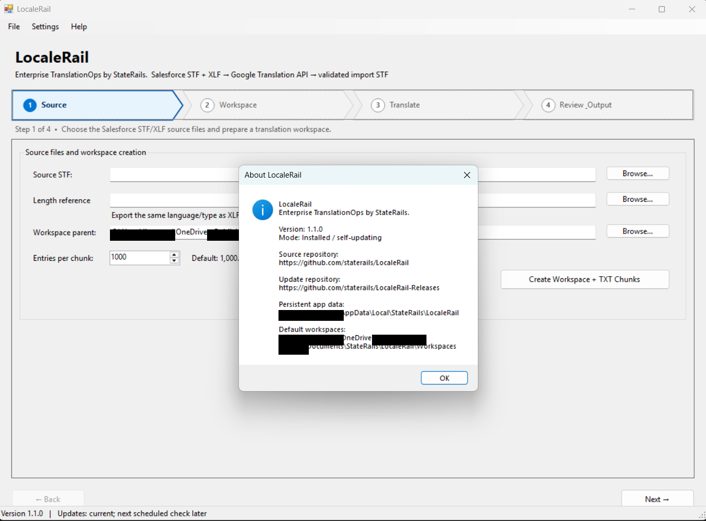
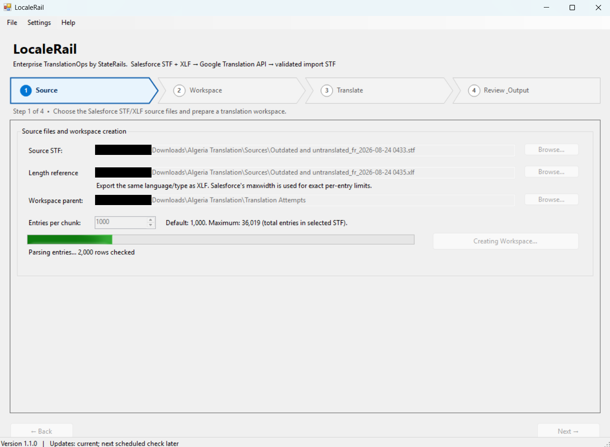
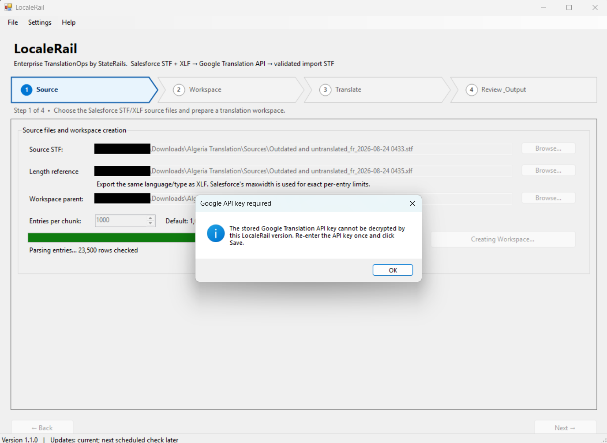
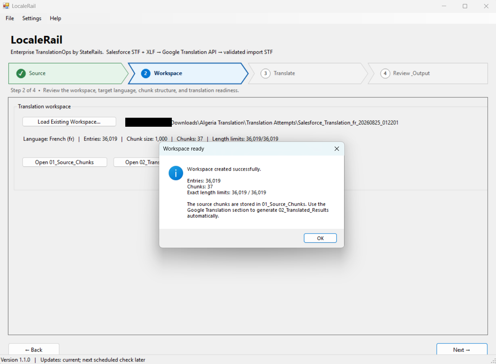
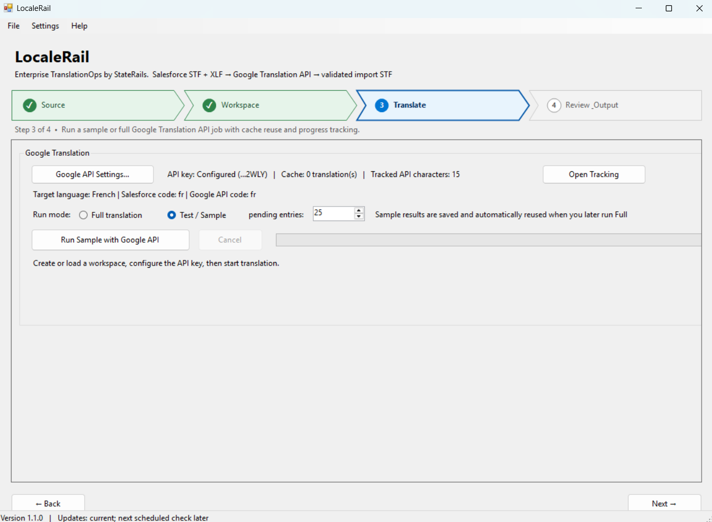
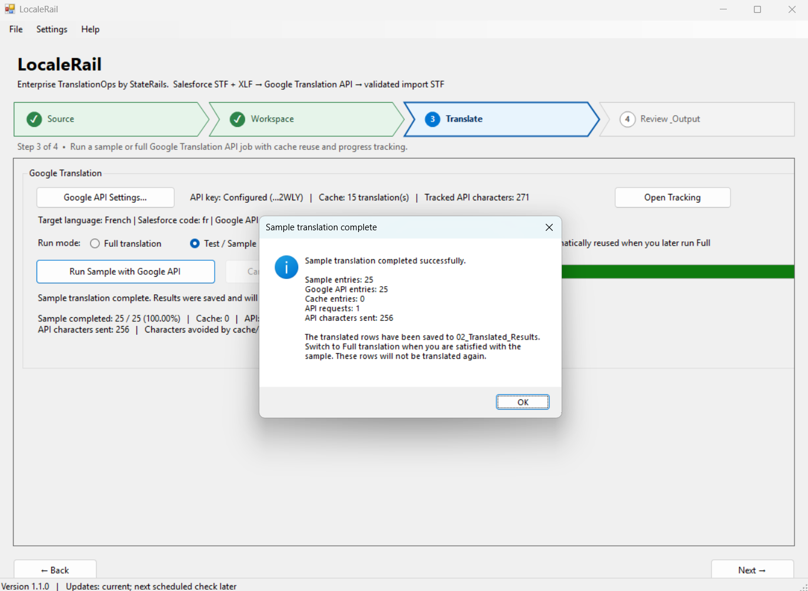
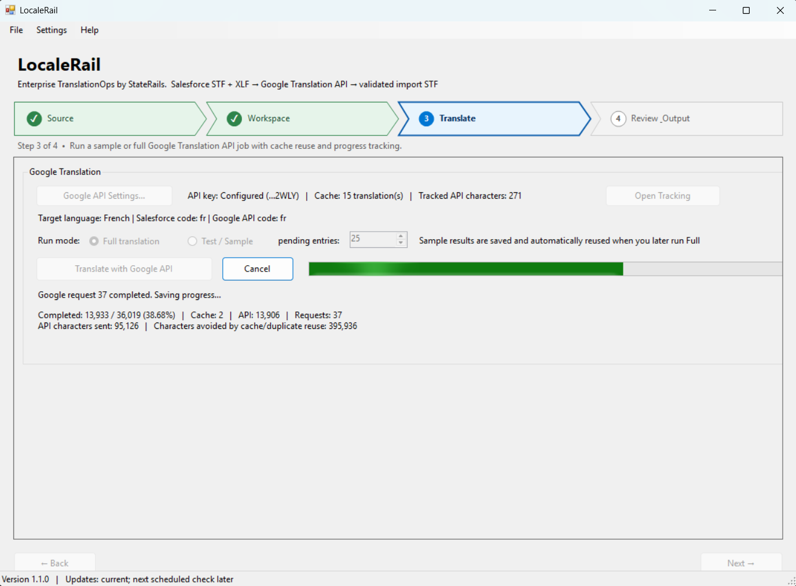

# LocaleRail User Guide

**Enterprise TranslationOps by StateRails.**

[Back to the LocaleRail README](../README.md) · [Product overview](PRODUCT_OVERVIEW.md) · [Download official releases](https://github.com/staterails/LocaleRail-Releases/releases)

This guide illustrates the LocaleRail v1.1.0 four-step Salesforce translation workflow. For capabilities added in later versions, consult the [current release notes](https://github.com/staterails/LocaleRail-Releases/releases) and the in-application help.

## 1. Overview

LocaleRail provides a structured workflow for Salesforce translation exports:

1. **Source** — select the Salesforce STF and matching XLF.
2. **Workspace** — review language, entry count, chunks and length coverage.
3. **Translate** — run sample or full Google Translation API processing.
4. **Review & Output** — validate results and generate the final Salesforce STF.

Path colors:
- **Blue** — active step
- **Green** — completed step
- **Gray** — upcoming step

## 2. Prerequisites

Prepare:
- a Salesforce **Outdated and untranslated STF** export;
- a matching **XLF** export for the same language and metadata scope;
- a valid Google Cloud Translation API key;
- internet access;
- a writable workspace folder.

The XLF is used as the Salesforce length reference.

## 3. Install and Update

Use **Help → About** to confirm the installed version, repositories, persistent data path and default workspace.

## 4. Step 1 — Source

Select:
- **Source STF**
- **Length reference** (XLF)
- **Workspace parent**
- **Entries per chunk**

The default chunk size is **1,000**. After LocaleRail reads the STF, the maximum becomes the actual translation-entry count in the file.

In the example:
- entries: **36,019**
- chunk size: **1,000**
- maximum: **36,019**

### API key re-entry

If LocaleRail cannot decrypt a previously stored API key, re-enter it once in **Google API Settings** and save it.

## 5. Step 2 — Workspace

After parsing succeeds, LocaleRail creates the workspace and displays:
- language;
- total entries;
- chunk size;
- chunk count;
- exact XLF length-limit coverage.

Example:
- Language: French (`fr`)
- Entries: 36,019
- Chunk size: 1,000
- Chunks: 37
- Exact length limits: 36,019 / 36,019

Source chunks are stored under `01_Source_Chunks`. Translation results are stored under `02_Translated_Results`.

## 6. Step 3 — Translate

The Translate step shows:
- API key status;
- cache size;
- tracked API characters;
- target language;
- Salesforce and Google language codes;
- run mode;
- progress and usage metrics.

### Test / Sample

Use sample mode before running the full dataset.

Sample results are saved and reused later.

Sample mode does **not** mark the Translate step complete.

### Full translation

When satisfied with the sample, switch to **Full translation**.

LocaleRail reports:
- completed entries and percentage;
- cache entries;
- API entries;
- request count;
- API characters sent;
- characters avoided through cache/duplicate reuse.

## 7. Step 4 — Review & Output

After full translation and validation:
- review remaining issues;
- review Salesforce length failures;
- generate the final STF;
- confirm the final output exists.

LocaleRail does not silently truncate over-length translations.

## 8. Tracking, Cache and API Usage

LocaleRail tracks:
- API requests;
- characters sent;
- cache reuse;
- retries;
- run progress;
- resumable state.

Use **Open Tracking** from the Translate step to inspect details.

## 9. Common Messages

### Workspace created successfully
The STF/XLF inputs were parsed and the workspace was created.

### Stored API key cannot be decrypted
Re-enter the key once and save it.

### Sample translation completed successfully
The sample rows were saved and will be reused in a later full run.

## 10. Troubleshooting

### Source parsing takes time
Large Salesforce exports can contain tens of thousands of rows. Allow parsing to complete.

### API translation cannot start
Confirm the API key is valid, Google Cloud Translation is enabled, and internet access is available.

### Salesforce output has length issues
Confirm the STF and XLF match the same target language and export scope.

### Full translation is slower than expected
Review request-size settings, delays, retries, throttling, network latency and Google API limits.

## 11. Best Practices

- Run a sample before every full translation.
- Always use matching STF and XLF exports.
- Keep cache reuse enabled unless a fresh translation is intentional.
- Preserve the workspace until Salesforce import is verified.
- Review length failures rather than truncating translations.
- Keep LocaleRail updated through the built-in updater.

## Official product and releases

LocaleRail is proprietary software developed by StateRails. Its source code is maintained privately and is not distributed through this public repository.

- [LocaleRail product README](../README.md)
- [Official releases and downloads](https://github.com/staterails/LocaleRail-Releases/releases)
- [Installation guide](INSTALLATION.md)
- [Data Handling and Security](DATA_HANDLING_AND_SECURITY.md)
